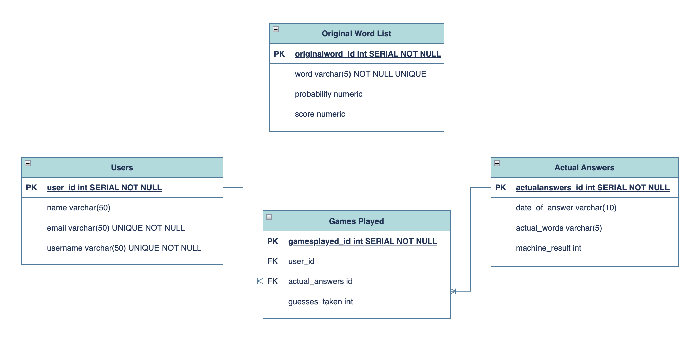

# Wordle Helper Back-End Group Project

We are The Imitation Game, a team consisting of BNTA Cohort 4 members, [Alex](https://github.com/oleksiysmola), [Cristian](https://github.com/Roscaaa), [Suad](https://github.com/suadali), [Rosalinda](https://github.com/rosaacodes), and [Rachel](https://github.com/rkaurb).

<!--  -->

<!-- What we've created, what inspired it -->

<!-- Include Tech Stack - how client-side was built -->

 

## Minimum Viable Product (MVP)

**Must-haves:**

_Helper Mode_
* Service logic
* Integration of an API (Controller), to send HTTP requests to progress game of Wordle
* Integration with database containing the words (DAO interface with database implementation)
* SQL file, with instructions to set up database and tables
* Text (csv) file including full list of words, together with probabilities and scores
* A Class which populates the Words table with data from text (csv) file

_Competitive Mode_
* Allow user to create User POJOs
* Create a user in database
* Allow user to input their number of guesses for a certain date
* Allow users to compare their performance vs the computer, for a certain date
* Allow user to retrieve their average guesses
* Play full game method (retrieve computer guess)

 

## Potential Extensions to MVP

**Nice-to-haves (if time):**

* Leaderboard
* Authentication

**Stretch objective:**

* Integrate with Wordle - web-scrape number of guesses for user to win (not relying on self-reporting)

 

HTTP Requests

**Primary Helper Mode Requests**

HTTP Request  | Type   | Function
------------- |--------| -------------
localhost:8080/helper | GET    | Get all words
localhost:8080/helper/ranked | GET    | Get all words ranked by score
localhost:8080/helper/ranked/{numOfWords} | GET    | Get all words ranked by score and specify how many words returned
localhost:8080/helper/start | GET    | Start the game. Will return best guesses ordered by score
localhost:8080/helper/start/{word} | DELETE | Input your guess for {word} and include the pattern that you got from Wordle in request body as JSON (i.e: which letters were green, yellow, grey)
localhost:8080/helper/endgame | DELETE | Ends game when you got the correct word

**Secondary Helper Mode Requests**

HTTP Request  | Type | Function
------------- |------| -------------
localhost:8080/helper/wordbyid/{id} | GET  | Get word by word id
localhost:8080/helper/wordbyname/{nameofword} | GET  | Get word by word name

 

**Primary Competitive Mode Requests**

HTTP Request  | Type   | Function
------------- |--------| -------------
localhost:8080/competitive/computemachinescores | PUT    | Required to run as part of Competitive Mode setup. This will populate machine guesses in actual_answers table
localhost:8080/competitive/all | GET    | Get all games in database
localhost:8080/competitive/addgame | POST   | Add new game (JSON) to database using Request Body 
localhost:8080/competitive/dailyresults/{date}| GET    | Get all result on given date
localhost:8080/competitive/userresults/{username}/{date}| GET    | Get all result on for username given date
localhost:8080/competitive/userresults/{username}| GET    | Get all result on for username
localhost:8080/competitive/averageresults/{username}| GET    | Get the average of a user's guesses
localhost:8080/competitive/start/{userId}| GET    | Start a game for a user with matching id
localhost:8080/competitive/start/{userid}/{guess}| DELETE | Input the user's guessed in {guess}. Repeat for each guess until game is complete
localhost:8080/competitive/start/{userid}/end| POST   | End game for user and save result to database
localhost:8080/user| GET    | Get all users from database
localhost:8080/user/{userId}| GET    | Get user from database by id
localhost:8080/user| POST   | Add user (JSON)  to database using Request Body

**Secondary Competitive Mode Requests**

HTTP Request  | Type   | Function
------------- |--------| -------------
localhost:8080/competitive/{id} | PUT    | Update game (JSON) by id through Request Body
localhost:8080/competitive/{id} | DELETE | Delete game by id
localhost:8080/competitive/{id} | GET    | Get game by id
localhost:8080/answers | GET    | Get all answers
localhost:8080/answers/{id} | GET    | Get an answer by answer id
localhost:8080/answers/addanswer | POST   | Add answer (JSON) using Request Body
localhost:8080/answers/{id} | DELETE | Delete answer by id
localhost:8080/answers/update/{id} | PUT    | Update answer (JSON) by id using Request Body 
localhost:8080/user/{userId} | DELETE | Delete user by id
localhost:8080/user/{userId} | PUT    | Update user (JSON) by id using Request Body 

 

## Planning & Schedule

Date  | Tasks
------------- | -------------
**Sunday (20/02)** | _Whiteboard group planning against Requirements:_    POJOs, Controller Layer, Service Layer, DAO Layer, Tables   
**Monday (21/02)** | Create ER Diagram    _Version 1:_    • (Re)build version 1 of wordle solver (mob programming)   • Write tests for methods in version 1 (pair programming)   
**Tuesday (22/02)**  | _Version 2:_    • DAO Layer to access DB    • Method to import from CSV to words table   • Integrate with wordle database    Integration of an API (Controller), to send HTTP requests to progress game of Wordle    Testing of all methods in Helper Mode   
**Wednesday (23/02)** | _Work on Competitive Mode:_    • Have post request to allow users to create User Object (POJO), and add this to database   • Create SQL tables for games played, users, and actual answers   • Take the actual answers from the Wordle website, and match them to the date on the txt (csv) file   • Re-use the function to import from txt (csv) file   • Create new controller class for users   • Create users package   • Create user DAO and Data Access Service   • Creater user service   • Add methods - e.g., playFullGame (returns number of guesses for the computer)   • In DataAcessService, include method which uses Join   • Add custom exception   
**Thursday (24/02)** | _To Do:_    • Finish testing   • Clean up code   • Plan presentation    Presentation dry-run   
**Friday (25/02)** | Client presentations   

 

## Project Structure

**Original ER Diagram:** 

 

## How to deploy Wordle Helper

 

<!-- ## Future improvements? -->

<!-- ## Acknowledgements -->

